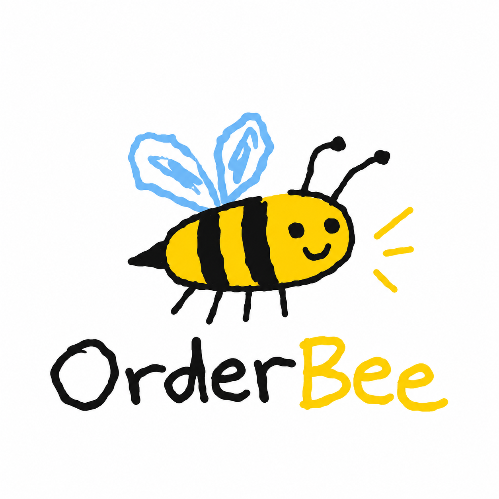

<p align="center">
  
</p>

# 🐝 OrderBee

**Orders in. Bees at work.**

API de pedidos com criação síncrona e processamento assíncrono de reservas de estoque via **RabbitMQ**.

O OrderBee simula uma pequena colmeia de processamento: a API recebe o pedido e responde sem esperar pelo trabalho pesado. Depois, uma "abelha" (worker) pega a tarefa da fila e cuida do processamento de forma assíncrona.

> 📦 **Pedido criado → 📨 Fila → 🐝 Worker → 📦 Estoque reservado → 📢 Evento**

O objetivo deste projeto é demonstrar como estruturar, testar e tomar decisões em um cenário que combina **API, banco relacional, mensageria, processamento assíncrono e eventos**.

### 📚 Documentação

- 🏗️ Arquitetura: [`docs/ARCHITECTURE.md`](docs/ARCHITECTURE.md)
- 📐 Decisões de arquitetura (ADRs): [`docs/adr/`](docs/adr/)
- 🗺️ Plano de implementação: [`docs/PLAN.md`](docs/PLAN.md)
- 💭 Respostas às perguntas de arquitetura: [`RESPOSTAS.md`](RESPOSTAS.md)

---

## 🍯 Como rodar

### 1. Prepare a colmeia

```bash
cp .env.example .env
docker compose up --build
```

O Compose sobe:

- 🗄️ `mysql`
- 📨 `rabbitmq`
- 🔄 `migrate` (one-shot)
- 🐝 `api`
- 🐝 `worker`

A colmeia está pronta quando:

```text
GET http://localhost:3000/health
```

responder `200`.

### 2. 🌱 Coloque alguns pedidos de teste

Seed com usuários e produtos de teste:

```bash
docker compose exec api npm run seed
```

**Usuários**

| Usuário | Senha | Role |
|---|---|---|
| `user@test.local` | `user123` | `USER` |
| `admin@test.local` | `admin123` | `ADMIN` |

**Produtos**

- `Widget`
- `Gadget`
- `Gizmo`

Estoque inicial: **5 unidades de cada produto**.

### 🔎 Ferramentas

- **Swagger:** `http://localhost:3000/docs`
- **RabbitMQ Management:** `http://localhost:15672` (`guest` / `guest`)
- **Postman:** [`docs/postman/order-bee.postman_collection.json`](docs/postman/order-bee.postman_collection.json)

A collection do Postman já está preparada para o fluxo completo:

- `POST /auth/login` captura `{{token}}` automaticamente.
- As demais requests já usam `Bearer {{token}}`.

### 🏠 Rodando fora do Compose

Para rodar localmente com:

```bash
npm run start:dev
npm run start:worker:dev
```

aponte o `.env` para `localhost` em vez dos hostnames dos serviços.

---

## 🐝 Como o pedido viaja pela colmeia

O fluxo principal é:

```text
                    ┌──────────────┐
                    │     API      │
                    │  POST order  │
                    └──────┬───────┘
                           │
                           ▼
                    ┌──────────────┐
                    │   MySQL      │
                    │    Order     │
                    └──────┬───────┘
                           │
                           ▼
                    ┌──────────────┐
                    │    Outbox    │
                    │    Event     │
                    └──────┬───────┘
                           │
                           ▼
                    ┌──────────────┐
                    │  RabbitMQ    │
                    │    Queue     │
                    └──────┬───────┘
                           │
                           ▼
                    ┌──────────────┐
                    │ 🐝 Worker    │
                    │  processing  │
                    └──────┬───────┘
                           │
                           ▼
                    ┌──────────────┐
                    │   Reserva    │
                    │   estoque    │
                    └──────────────┘
```

A API não precisa esperar a "abelha" terminar o trabalho para responder à criação do pedido.

---

## 🧪 Testes

```bash
npm run test              # unidade
npm run test:e2e          # e2e, MySQL real via Testcontainers
npm run test:integration  # MySQL + RabbitMQ reais via Testcontainers
```

Os testes de concorrência, idempotência e retry **não usam mocks**.

A estratégia e as regras para esses testes estão documentadas em [`docs/AGENTS.md`](docs/AGENTS.md).

---

## 🏗️ Decisões de arquitetura

A visão geral está em [`docs/ARCHITECTURE.md`](docs/ARCHITECTURE.md).

As principais decisões estão registradas nos ADRs:

| ADR | Decisão |
|---|---|
| [0001](docs/adr/0001-reserva-de-estoque-atomica-e-idempotente.md) | Reserva de estoque atômica e idempotente (⭐ requisito central) |
| [0002](docs/adr/0002-classificacao-de-falhas-no-worker.md) | Classificação de falhas: negócio vs. técnica |
| [0003](docs/adr/0003-worker-como-processo-separado.md) | Worker como processo separado da API |
| [0004](docs/adr/0004-rabbitmq-com-retry-por-filas-de-atraso.md) | RabbitMQ com retry por filas de atraso e DLQ |
| [0005](docs/adr/0005-transactional-outbox.md) | Transactional outbox para publicar sem dual write |
| [0006](docs/adr/0006-jwt-proprio-com-roles.md) | JWT próprio com roles (SSO descrito abaixo) |
| [0007](docs/adr/0007-typeorm-como-orm.md) | TypeORM como ORM |
| [0008](docs/adr/0008-validacao-de-produto-no-post.md) | Validação de produto no `POST /orders` |
| [0009](docs/adr/0009-registro-de-conta-e-softdelete-de-usuario.md) | Registro de conta, soft delete e troca de role com auditoria |
| [0010](docs/adr/0010-login-via-google-sso.md) | Login via Google (SSO real, aditivo ao JWT local) |

### ⚖️ Trade-offs reconhecidos

- 👤 **Regra de posse:** `USER` só vê os próprios pedidos (`GET /orders` e `GET /orders/:id` filtrados por `created_by`); `ADMIN` vê todos. Pedido de outro usuário responde `404`, não `403`, para não revelar que o pedido existe.
- 💲 **Preço vem do cliente:** o enunciado envia `price` no payload e `products` não tem coluna de preço. Aceitamos como especificado; em produção o preço viria do catálogo, nunca do cliente.
- 🚫 **`FAIL_NOW` hoje não é alcançado no worker:** `InsufficientStockError` é tratado dentro de `StockService.reserve` (que marca `FAILED` na hora). O caminho continua em `decideFailureAction` para futuros erros de negócio ([ADR-0002](docs/adr/0002-classificacao-de-falhas-no-worker.md)).
- ☠️ **Mensagem ilegível (poison message):** payload que não é JSON vai direto para a DLQ (`order.poison_message` no log), sem retry — tentar de novo não ajuda.
- 🧾 **Correlation ID do cliente:** o header `x-correlation-id` só é aceito se for UUID; qualquer outro valor é substituído por um novo, porque vai para colunas `CHAR(36)` e para os logs.
- ⏱️ **Outbox com broker fora do ar:** `publishTimeout` de 5 s faz o relay desistir e liberar a transação (e os locks) em vez de esperar o broker voltar; o próximo tick tenta de novo.

---

## 🔐 Login via Google (SSO real)

Bônus implementado: `POST /auth/google` recebe `idToken` do Google, valida via `google-auth-library` (JWKS oficial, `aud` = `GOOGLE_CLIENT_ID`) e faz *upsert* do usuário local pelo e-mail verificado (cria com `role: 'USER'` se não existir). Conta soft-deletada não volta via Google (`401`), e dois primeiros logins simultâneos com o mesmo e-mail reaproveitam a mesma conta. Emite o mesmo JWT HS256 de `POST /auth/login` — é aditivo, login local continua funcionando. Decisão e alternativas em [ADR-0010](docs/adr/0010-login-via-google-sso.md).

```bash
curl -X POST {{baseUrl}}/auth/google \
  -H "Content-Type: application/json" \
  -d '{"idToken": "<google-id-token>"}'
```

## 🔐 Integração com Keycloak/Auth0 (full resource-server)

O teste pede JWT próprio com usuário de teste; SSO completo (multi-provedor, resource-server) fica **descrito, não implementado**. Esse trade-off está documentado no [ADR-0006](docs/adr/0006-jwt-proprio-com-roles.md).

Para trocar a autenticação atual:

- `JwtStrategy` passa a validar **RS256** com chaves do endpoint JWKS do provedor (`jwks-rsa`, com cache), em vez de segredo HS256 local.
- Validação de `iss` e `aud`.
- Roles extraídas de `realm_access.roles` (Keycloak) ou de claim customizada (Auth0).
- `POST /auth/login` e `users.password_hash` deixam de existir; a API vira apenas **resource server**, enquanto o provedor cuida da autenticação.
- `RolesGuard` e `@Roles()` não mudam: dependem apenas do payload decodificado, não de quem emitiu o token.

Impacto de indisponibilidade e mitigação: ver pergunta 4 em [`RESPOSTAS.md`](RESPOSTAS.md).

---

## 🔍 Investigação com logs

Toda a trilha de uma abelha pode ser acompanhada. 🐝

O sistema usa **Pino (JSON)** com `correlationId` propagado por todo o fluxo:

```text
request
   ↓
orders.correlation_id
   ↓
outbox_events
   ↓
message header
   ↓
logger filho no consumer
```

Eventos registrados:

- `order.created`
- `outbox.published`
- `order.processing.started`
- `order.retry.scheduled`
- `order.processed`
- `order.failed`
- `order.dead_lettered`
- `order.poison_message` (payload ilegível, vai direto para a DLQ)

A definição completa está na seção 13 de `docs/ARCHITECTURE.md`.

### 🐝 E se uma abelha se perder?

Para investigar um **"pedido X travado"**, basta filtrar os logs pelo `correlationId` e acompanhar a trilha até descobrir onde o processamento parou.

O fluxo de investigação está detalhado na pergunta 5 de [`RESPOSTAS.md`](RESPOSTAS.md).

---

## 🌼 O que faria com mais tempo

A colmeia ainda pode crescer. Algumas evoluções planejadas:

- 📊 **Métricas:** profundidade das filas, taxa de falha e latência de processamento expostas em `/metrics` (Prometheus).
- 🧹 **Limpeza do outbox:** job para arquivar ou apagar eventos publicados antigos.
- 🔄 **Refresh token e revogação:** atualmente o JWT expira em 15 min sem renovação.
- 🔐 **Google SSO — link/unlink de conta:** hoje o e-mail verificado pelo Google casa automaticamente com uma conta local existente; um fluxo explícito de vincular/desvincular deixaria essa superfície de confiança mais visível para o usuário.
- 🔐 **SSO resiliente (Keycloak/Auth0):** cache do `jwks-rsa` e circuit breaker explícitos caso a integração completa do ADR-0006 seja implementada de fato.

---

## 🐝 TL;DR

**OrderBee** recebe o pedido, coloca o trabalho na fila e deixa as abelhas cuidarem do processamento.

A API responde rápido.  
O worker trabalha em segundo plano.  
O estoque é reservado de forma atômica e idempotente.  
Os eventos deixam uma trilha observável.  
E os ADRs registram o porquê das decisões.

**Orders in. Bees at work. 🐝**