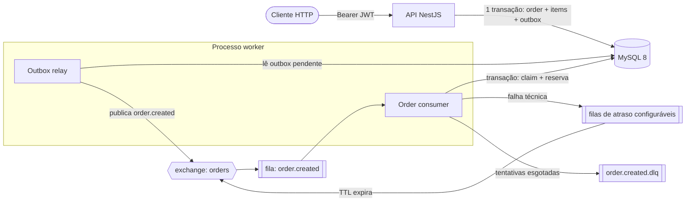
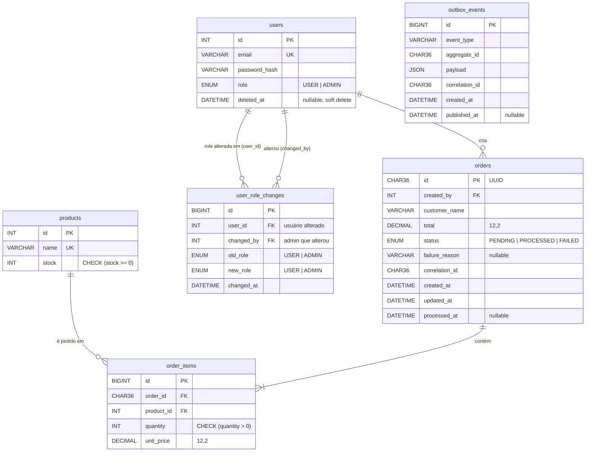
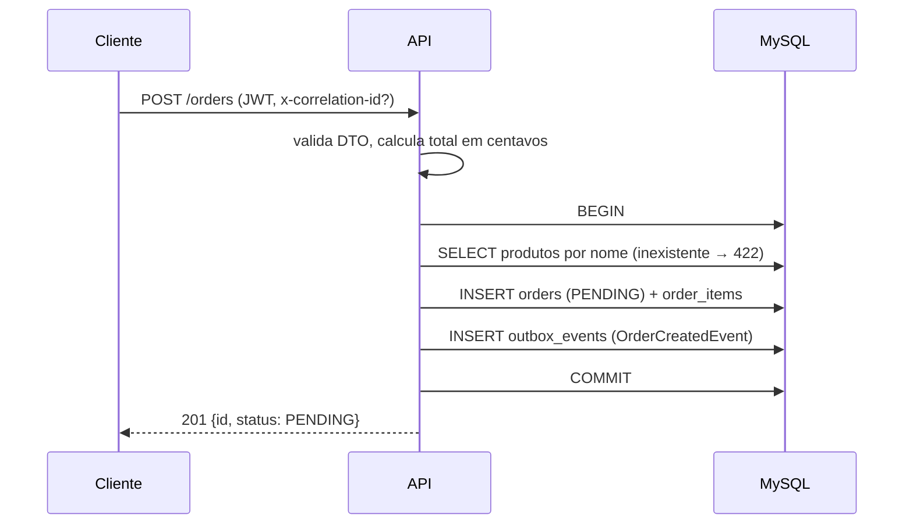
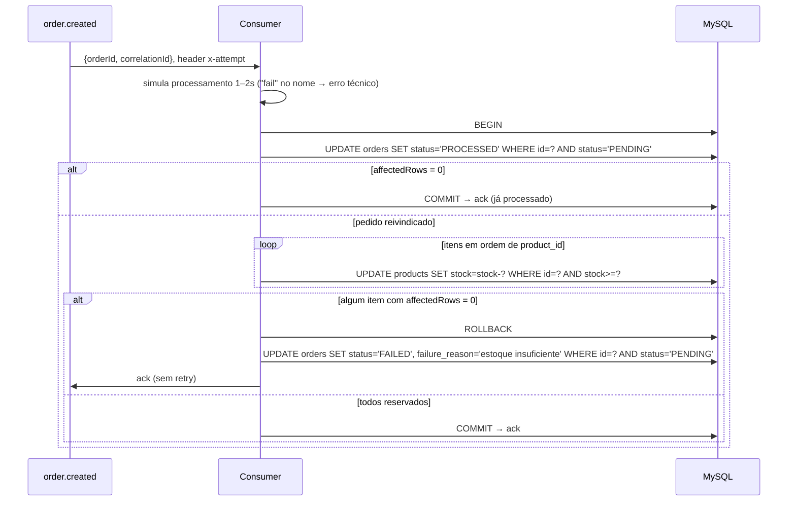

# Arquitetura — Sistema de Pedidos com Processamento Assíncrono

> Documento vivo. Decisões registradas como ADRs em [`adr/`](adr/). Mudou uma decisão? Novo ADR que substitui o anterior; não se edita ADR aceito.

## 1. Objetivo

API de pedidos em que a criação é síncrona e rápida, e o processamento (reserva de estoque) acontece de forma assíncrona via fila. O foco não é volume de funcionalidades, e sim demonstrar:

- desacoplamento real entre API e processamento;
- corretude sob concorrência (nunca vender além do estoque);
- idempotência sob entrega *at-least-once*, de ponta a ponta;
- falhas tratadas com intenção (o que tenta de novo, o que falha na hora);
- testes que quebrariam se o problema acontecesse em produção.

## 2. Stack

| Camada | Escolha | ADR |
|---|---|---|
| Framework | NestJS (TypeScript) | exigência |
| Banco | MySQL 8 | exigência |
| ORM | TypeORM | [0007](adr/0007-typeorm-como-orm.md) |
| Broker | RabbitMQ via `amqplib` + `amqp-connection-manager` | [0004](adr/0004-rabbitmq-com-retry-por-filas-de-atraso.md) |
| Publicação | Transactional Outbox | [0005](adr/0005-transactional-outbox.md) |
| Autenticação | JWT próprio (HS256) com roles | [0006](adr/0006-jwt-proprio-com-roles.md) |
| Logs | Pino (`nestjs-pino`) + correlation ID | seção 10 |
| Testes | Jest + Supertest + Testcontainers (MySQL e RabbitMQ reais) | seção 11 |
| Infra local | Docker Compose | — |

## 3. Visão geral



- **API** e **worker** vivem no mesmo repositório e na mesma imagem, com *entrypoints* diferentes ([ADR-0003](adr/0003-worker-como-processo-separado.md)).
- A API **nunca fala com o RabbitMQ**. Ela só grava no banco; o relay publica. Isso elimina o *dual write* ([ADR-0005](adr/0005-transactional-outbox.md)).
- Arquitetura **modular em camadas** (monólito modular): um módulo NestJS por domínio, controller → service → repository.

## 4. Estrutura de pastas

```
src/
├── main.ts                     # API HTTP
├── main.worker.ts              # worker: relay + consumer, sem HTTP
├── app.module.ts
├── worker.module.ts
├── modules/
│   ├── auth/                   # login, JwtStrategy, RolesGuard, @Roles()
│   ├── users/
│   ├── orders/
│   │   ├── orders.controller.ts
│   │   ├── orders.service.ts
│   │   ├── orders.repository.ts
│   │   ├── dto/
│   │   ├── entities/
│   │   └── domain/             # sem NestJS, sem ORM
│   │       ├── order-status.enum.ts
│   │       ├── calculate-order-total.ts
│   │       └── events/order-created.event.ts
│   ├── stock/
│   │   ├── stock.service.ts            # ADR-0001
│   │   └── errors/insufficient-stock.error.ts
│   └── processing/
│       ├── order.consumer.ts           # ack / retry / DLQ
│       ├── order-processing.service.ts
│       ├── decide-failure-action.ts    # função pura, ADR-0002
│       └── errors/simulated-processing.error.ts
└── shared/
    ├── database/               # data source, migrations, seeds
    ├── outbox/                 # entidade, repositório, relay
    ├── messaging/              # conexão, topologia, publisher
    ├── logging/                # Pino, middleware de correlation ID
    └── errors/                 # BusinessError (base)
test/
├── e2e/
└── integration/
```

Regra de dependência: `domain/` não importa NestJS, ORM nem broker.

## 5. Modelagem de dados



| Ponto | Escolha | Por quê |
|---|---|---|
| Dinheiro | `DECIMAL(12,2)`; centavos inteiros no domínio | Sem erro de ponto flutuante no total |
| Estoque | `CHECK (stock >= 0)` | Defesa em profundidade: o banco recusa negativo mesmo com bug |
| ID do pedido | UUID `CHAR(36)` | Não enumerável. Trade-off: `BINARY(16)` indexa melhor |
| Preço | `unit_price` congelado no item | Histórico não muda com o catálogo |
| `created_by` | FK para `users` | Auditoria de quem criou; regra de posse: `USER` só lê os próprios pedidos (404 para os de outros), `ADMIN` lê todos |
| `outbox_events.id` | `BIGINT` autoincremento | Garante ordem de publicação |
| Índices | `orders(status, created_at)`, `orders(created_at, id)`, `products(name)` único, `outbox_events(published_at, id)` | Busca de travados, paginação, lookup, relay |

O enunciado envia `price` no payload. Aceitamos conforme especificado; o README registra que, em produção, o preço viria do catálogo, nunca do cliente. Produto inexistente é rejeitado no POST com 422 ([ADR-0008](adr/0008-validacao-de-produto-no-post.md)).

## 6. Criação — `POST /orders`



O enunciado não fixa o formato do payload; a forma abaixo foi definida nesta implementação:

```json
// POST /orders
{
  "customerName": "Alice",
  "items": [{ "productName": "Widget", "quantity": 2, "price": 19.90 }]
}
// 201
{ "id": "<uuid>", "status": "PENDING" }
```

`price` é o preço unitário em reais (decimal, até 2 casas); convertido para centavos internamente (`domain/money.ts`) antes de `calculateOrderTotal`. `POST /orders` exige `Authorization: Bearer <JWT>` — `JwtStrategy` foi adiantada da Etapa 7 para esta etapa (só decodifica e valida o token; login, `RolesGuard` e `@Roles()` continuam na Etapa 7) porque `orders.created_by` é obrigatório desde a criação do pedido.

O `OrderCreatedEvent` é um evento de domínio; o outbox é o mecanismo que o persiste. O service não sabe que existe RabbitMQ. A mensagem carrega **só `orderId` e `correlationId`**: o worker relê o pedido, e o banco é a fonte da verdade.

## 7. Publicação — outbox relay

Roda no processo worker, a cada ~500 ms:

```sql
BEGIN;
SELECT * FROM outbox_events
  WHERE published_at IS NULL
  ORDER BY id LIMIT 50
  FOR UPDATE SKIP LOCKED;
-- publica cada evento com publisher confirms
UPDATE outbox_events SET published_at = NOW() WHERE id IN (...);
COMMIT;
```

- `SKIP LOCKED` permite várias réplicas do worker sem publicar o mesmo lote em paralelo.
- Se o relay cai depois de publicar e antes do COMMIT, o evento é publicado de novo. **Isso é aceitável por design**: o outbox garante *at-least-once*, e o consumer idempotente (seção 8) transforma isso em efeito único.

## 8. Processamento — consumer



A simulação acontece **fora** da transação, para não segurar locks durante o *sleep*. Ack manual, `prefetch` 10.

## 9. Concorrência no estoque ⭐

Decisão completa em [ADR-0001](adr/0001-reserva-de-estoque-atomica-e-idempotente.md).

### 9.1 O problema: *check-then-act*

```ts
const product = await repo.findOne(id);   // lê stock = 5
if (product.stock >= quantity) {          // verifica
  product.stock -= quantity;              // ← outro worker pode ter decrementado aqui
  await repo.save(product);               // grava
}
```

Entre a leitura e a escrita, o estado muda. É uma race condition clássica (TOCTOU, *time-of-check to time-of-use*), a mesma de venda de ingressos ou de Black Friday. Estoque 5, três pedidos de 2 processados ao mesmo tempo: todos leem 5, todos passam, e o estoque termina em −1.

### 9.2 São dois problemas

| Problema | Escopo | Pergunta |
|---|---|---|
| **Overselling** | o *produto* | "Há estoque para este item agora?" |
| **Decremento duplicado** | o *pedido* | "Este pedido já reservou?" |

Resolver um não resolve o outro. Lock otimista (`version`) protege o produto, mas um retry lê a versão atual e decrementa de novo: a versão não sabe *qual pedido* já foi aplicado.

### 9.3 Alternativas

| Estratégia | Overselling | Retry duplicado | Custo |
|---|---|---|---|
| `SELECT ... FOR UPDATE` | ✅ | ❌ sozinho | Segura linhas durante a lógica da aplicação |
| Lock otimista (`version`) | ✅ | ❌ | Loop de retry na aplicação sob contenção |
| **`UPDATE ... WHERE stock >= ?`** | ✅ | ❌ sozinho | Uma instrução atômica |
| Tabela de idempotência | ❌ | ✅ | Tabela extra |
| **Claim por status, mesma transação** | — | ✅ | Nenhum |

### 9.4 Escolha

UPDATE condicional atômico + claim do pedido por transição de status, **na mesma transação** (Unit of Work):

- **Cai antes do COMMIT** → tudo desfeito; retry encontra `PENDING` e estoque intacto.
- **Cai depois do COMMIT** → retry encontra `PROCESSED`; claim afeta 0 linhas; ack.
- **Duas entregas simultâneas** → o claim trava a linha do pedido; a segunda espera e afeta 0 linhas.

### 9.5 Deadlock com vários itens

Pedido A reserva (1, 2), pedido B reserva (2, 1): cada um trava uma linha e espera a outra. Mitigação: **sempre em ordem crescente de `product_id`**. `ER_LOCK_DEADLOCK` residual é erro técnico → retry.

### 9.6 Prova

Teste de integração com **MySQL real**: estoque 5, três pedidos de 2 processados com `Promise.all`. Esperado: 2 `PROCESSED`, 1 `FAILED` com "estoque insuficiente", estoque final 1. Um segundo teste reprocessa um pedido já `PROCESSED` e verifica que o estoque não mudou.

## 10. Falhas, retry e dead-letter

Decisões em [ADR-0002](adr/0002-classificacao-de-falhas-no-worker.md) e [ADR-0004](adr/0004-rabbitmq-com-retry-por-filas-de-atraso.md).

| Tipo | Exemplos | Ação |
|---|---|---|
| **Negócio** | estoque insuficiente | `FAILED` imediato com motivo; ack; sem retry |
| **Técnica** | timeout, deadlock, `"fail"` no nome | republica na fila de atraso da tentativa (padrão 1s → 5s → 25s, via `RETRY_DELAYS_MS`); ack da original |
| **Técnica esgotada** | última tentativa (padrão: 4ª) | `FAILED` com o erro; publica em `order.created.dlq`; ack |

`decideFailureAction(error, attempt, maxAttempts)` retorna `RETRY | FAIL_NOW | FAIL_AND_DEAD_LETTER`. O consumer só executa. A verificação de estoque acontece **durante** a tentativa: checagem prévia reabriria a race condition.

Topologia RabbitMQ:

| Recurso | Tipo | Detalhe |
|---|---|---|
| `orders` | exchange topic | recebe `order.created` |
| `order.created` | fila durável | consumida pelo worker |
| `order.created.retry.{delayMs}` | uma fila por atraso configurado | `x-message-ttl` = atraso; `x-dead-letter-exchange: orders`, volta para `order.created` |
| `orders.dlx` → `order.created.dlq` | exchange + fila | mensagens esgotadas, para inspeção |

Reprocessamento manual (`POST /orders/:id/reprocess`, ADMIN): transição `FAILED → PENDING` e novo evento no outbox, na mesma transação. É seguro porque um pedido `FAILED` nunca decrementou estoque (a transação de reserva sofreu rollback).

## 11. Testes

| Nível | O quê | Infra |
|---|---|---|
| Unidade | `calculateOrderTotal`, `decideFailureAction` | nenhuma |
| e2e | `POST /orders` → pedido `PENDING` + linha no outbox; 401 sem token; 422 produto inexistente | MySQL real |
| Integração ⭐ | concorrência no estoque; reentrega não decrementa duas vezes; `"fail"` → retries → `FAILED` + DLQ | MySQL e RabbitMQ reais (Testcontainers) |

Regra: nenhum teste de concorrência ou idempotência usa mock de banco. Os testes de retry usam `RETRY_DELAYS_MS` em milissegundos.

## 12. Autenticação e autorização

JWT HS256 emitido por `POST /auth/login`, validado por `JwtStrategy`; `RolesGuard` + `@Roles()`.

| Endpoint | Público | USER | ADMIN |
|---|---|---|---|
| `POST /auth/register` | ✅ | — | — |
| `POST /auth/google` | ✅ | — | — |
| `POST /orders` | ❌ | ✅ | ✅ |
| `GET /orders`, `GET /orders/:id` | ❌ | ✅ | ✅ |
| `POST /orders/:id/reprocess` | ❌ | ❌ 403 | ✅ |
| `DELETE /users/:id` | ❌ | ❌ 403 | ✅ |
| `PATCH /users/:id/role` | ❌ | ❌ 403 | ✅ |

`POST /auth/register` (pública) cria conta com `role` sempre `USER`; `role` não é aceito no payload. `DELETE /users/:id` (ADMIN) é **soft delete**: seta `users.deleted_at` via `@DeleteDateColumn`, nunca remove a linha — `orders.created_by` continua íntegro; login exclui automaticamente usuários soft-deletados. `PATCH /users/:id/role` (ADMIN) troca a role de outro usuário e grava uma linha em `user_role_changes` (quem, de quem, role antes/depois, quando) na mesma transação — é o único caminho para criar uma nova conta `ADMIN` fora do seed. Nenhuma dessas duas rotas ADMIN permite que o admin altere a própria conta (`400` se `:id` for o próprio autenticado), para evitar lockout. Detalhes e trade-offs em [ADR-0009](adr/0009-registro-de-conta-e-softdelete-de-usuario.md).

`POST /auth/google` (pública) recebe `idToken` do Google, valida via `google-auth-library` (JWKS oficial, `aud` = `GOOGLE_CLIENT_ID`) e faz *upsert* de usuário local pelo e-mail verificado: se não existir, cria com `role: 'USER'` e um `password_hash` placeholder (login local por senha nunca vai funcionar para essa conta); se existir, reusa. Emite o mesmo JWT HS256 de `POST /auth/login` — `JwtStrategy`, `RolesGuard` e `@Roles()` não mudam. É aditivo ao login local, não o substitui. Decisão e alternativas em [ADR-0010](adr/0010-login-via-google-sso.md).

Usuários de teste criados por seed. Integração com Keycloak/Auth0 (full resource-server) continua só descrita no README ([ADR-0006](adr/0006-jwt-proprio-com-roles.md)).

## 13. Observabilidade

- Pino com logs JSON; `x-correlation-id` lido ou gerado na API.
- O correlation ID viaja: request → `orders.correlation_id` → `outbox_events` → header da mensagem → logger filho no consumer.
- Eventos de log: `order.created`, `outbox.published`, `order.processing.started`, `order.retry.scheduled`, `order.processed`, `order.failed`, `order.dead_lettered`.

"Pedido X ficou PENDING por 10 minutos": filtra pelo correlation ID. Sem `outbox.published` → relay parado (confere `outbox_events.published_at`). Publicado sem `processing.started` → fila ou worker (painel do RabbitMQ: mensagens prontas, consumers conectados). `retry.scheduled` repetido → falha técnica recorrente, motivo no log. `started` sem desfecho → worker caiu no meio (a mensagem sem ack volta para a fila).

`GET /health` retorna `{ status: 'ok' | 'degraded', db: 'up' | 'down', rabbitmq: 'up' | 'down' }`. O banco é dependência dura de praticamente toda rota: `db: 'down'` responde `503`. O RabbitMQ não é — a API nunca publica diretamente nele (ADR-0005) — então `rabbitmq: 'down'` só rebaixa `status` para `degraded` e mantém `200`; é informativo, para um monitor externo enxergar o broker fora do ar sem derrubar o healthcheck do container (`docker-compose.yml` já usa este endpoint para decidir se a API está saudável, e isso não pode depender do RabbitMQ estar de pé). `outbox.published` é logado por evento publicado, com `orderId` (= `aggregateId`) e `correlationId`, no mesmo padrão dos demais eventos desta lista.

## 14. Padrões de design

| Padrão | Onde | Motivo |
|---|---|---|
| Monólito modular / camadas | módulos NestJS | Separação por domínio sem custo operacional de microsserviços |
| Repository | `*.repository.ts` | Isola o ORM da regra de negócio |
| Domain Event | `OrderCreatedEvent` | Regra de negócio não conhece o broker |
| Transactional Outbox | criação e reprocessamento | Elimina o dual write banco + fila |
| Unit of Work | criação; reserva de estoque | Operações relacionadas como unidade atômica |
| Idempotent Consumer | claim por status | *At-least-once* sem efeito duplicado |
| Retry com backoff | filas de atraso | Falhas transitórias se resolvem sozinhas |
| Dead Letter Channel | `order.created.dlq` | Mensagens irrecuperáveis ficam inspecionáveis |
| Guard / Strategy | autenticação e roles | Padrão nativo do NestJS (Passport) |
